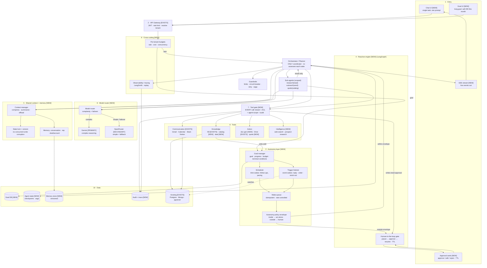

# Sales Agent Engine — Architecture
 
> Reference for how the Sales Agent Engine is structured and how its parts connect.
> Read this before changing how components interact. Build order lives in `implementation-plan.md`.
> `[NEW]` = built in this service · `[EXISTS]` = existing platform service the engine calls, never rebuilds.
 
---
 
## One-paragraph summary
 
The Sales Agent Engine is a new async Python microservice. A user gives it either a **single task** ("draft a follow-up to Acme") or a **long-running goal** ("sell 200 shirts this month"). An **autonomy layer** turns long goals into scheduled/triggered wake-ups that repeatedly drive a **reactive engine** (LangGraph orchestrator + scoped sub-agents). Every LLM call goes through a **model router** (Gemini primary, OpenRouter fallback). Every tool call goes through a single **tool gate** (tenant + ACL + per-agent scope + audit + human approval). The agent **streams its reasoning live** (SSE) and **pauses for human approval** before any real-world action. It reuses existing platform services (Composio, knowledge base, catalog) as tools rather than reimplementing them.
 
---

## As built: where the platform differs from this document

Verified against the code on 2026-09-11. The diagram below is the target, but these `[EXISTS]` pieces are missing or partial, so the engine works around them:

- **Identity.** The gateway now verifies the RS256 `access_token` (via auth-service JWKS) and injects `X-User-Id`, but it resolves no tenant and the engine's port can be reached without it. So the engine still verifies the token itself (JWKS, PEM fallback), using the `userId` claim, and never trusts `X-User-Id`. The tenant is the workspace UUID in `X-Tenant-Id`, and the engine checks membership with workspace-service. SSE takes the tenant from the session row instead.
- **Composio.** data-pipeline only runs read syncs. The engine calls the Composio SDK directly for read and write tools, using the same project and connections (Composio `user_id` = auth `userId`).
- **Workspaces (tenancy, decided 2026-09-11).** Every user has a workspace: `POST /api/v1/workspaces/default` (workspace-service) returns the caller's workspace and creates a personal one on first use, and the frontend loads it before rendering any workspace page. There is no shared placeholder workspace any more; `backend/data-pipeline/scripts/move_to_workspace.py` moves data saved under the old placeholder (`00000000-…-0001` catalog, `tenant_default` vault) into a real workspace. `GET /api/v1/workspaces` includes the caller's `role`.
- **Knowledge base.** The vault is shared by a workspace, like the catalog: data-pipeline checks the caller is a member of `X-Tenant-Id` (asking workspace-service, cached 60s), records the uploader, and lets only the uploader or an OWNER/ADMIN delete. No retrieval endpoint exists: vector search is a placeholder, embeddings are fake, there is no pgvector, and data-pipeline's document search only matches metadata. The KB adapter (`tools/adapters/knowledge.py`) ranks the workspace's documents by their sales metadata, reads the best candidates' text, and returns matching passages; real retrieval would replace only that file.
- **Catalog.** It is real (Postgres, scoped by workspace UUID, membership checked by data-pipeline) and served by data-pipeline, not a separate service. Its search ranks with BM25 over weighted product fields (`catalog/search_ranking.py`), optionally widened by LLM synonyms (the engine skips that). The adapter falls back to the keyword product filter on data-pipeline builds without ranked search. Prices and discount bounds arrive as decimal strings and are passed on unchanged.
- **Web search.** Both backends are used, as the user decided. Tavily returns ranked pages (it needs `TAVILY_API_KEY`). Gemini's Google Search grounding goes through the model router as a `web_grounded` task, on its own route (`SALES_AGENT_MODEL_WEB_GROUNDING`, default `gemini-2.5-flash`, because the free tier returns 429 for grounding on 3.x models), with no failover. Whichever is configured and answering is used.
- **Triggers.** Nothing publishes reply, order or stock-out events (the only Kafka topic is `auth-user-events`). The trigger listener polls (Gmail threads via Composio, catalog stock) behind one adapter interface.
- **Where data lives (decided 2026-09-11).** User-facing work meant for later retrieval (goals, tasks, notes) lives in **workspace-service**: a chat session is a workspace context (`AGENT_SESSION`, private to its starter), each write action is a task on its timeline, and sent emails and final answers are notes. Everything the agent needs in order to run lives in the **engine**: checkpoints, the approval queue, audit, saga, leases and the outbox. The engine records workspace items in `agent.workspace_outbox` first, and a worker delivers them as idempotent upserts, so workspace-service being slow or down never blocks or fails a run.
- **Deals.** No order or deal data exists anywhere. Where deals live (engine or workspace-service) is still open; decide before building the deal tool.
- **Storage.** The engine uses database `rolesync-micro-sales-agent`: schema `agent` (Alembic) and schema `agent_checkpoint` (LangGraph checkpointer tables).
- **Models.** Gemini's free tier serves Flash but not Pro, so `SALES_AGENT_MODEL_COMPLEX` defaults to `gemini-3.5-flash`; OpenRouter routes default to free `:free` models. All routes are set in `config.py`. Low-complexity tasks (such as the prospect brief digest) turn model reasoning off on OpenRouter: on the free reasoning models it used the entire token budget and cut the answer off.
- **Reads in parallel.** The orchestrator runs one write per graph step, so an approval pause replays only that call. Consecutive read calls that a model requests together run concurrently in one step: they can't pause and have no side effects.

---
 
## The layers (top to bottom)
 
1. **Entry** — chat UI (single task) and goal UI (long goal); live events stream back out, approval cards come back for sign-off.
2. **Gateway** `[EXISTS]` — JWT verify, rate limit, resolve tenant. Tenant/user identity comes from here, never from client input.
3. **Autonomy layer** `[NEW]` — goal manager, scheduler (time wakes), trigger listener (event wakes), wake queue (deduped, rate-controlled), and the autonomy policy envelope. Drives the reactive engine over time.
4. **Reactive engine** `[NEW]` — LangGraph orchestrator (sole coordinator), execution guardrails, scoped sub-agents, streaming + human-in-the-loop gate. This is invoked once per single task and once per wake.
5. **Shared context + memory** `[NEW]` — the only surface agents use for shared state; compress/summarize/offload + state locking with versioning.
6. **Model router** `[NEW]` — complex → Gemini, simple → OpenRouter, plus failover.
7. **Gated tool layer** `[NEW]` — the one choke point every tool call passes through.
8. **Tools** — communication (Gmail/Calendar/Slack/Notion `[EXISTS]`), knowledge (KB `[EXISTS]`, catalog/deal `[NEW]`), action (doc-gen/quote `[NEW]`, Drive `[EXISTS]`), intelligence (web search / prospect research `[NEW]`).
9. **Cross-cutting** `[NEW]` — observability/tracing (LangSmith) and per-tenant budgets.
10. **Data** — goals, agent state/checkpoints, versioned memory, audit + traces `[NEW]`; existing Postgres/Mongo/pgvector `[EXISTS]`.
---
 
## Diagram
 

 
---
 
## Key design decisions (the "why")
 
**One tool gate, no exceptions.** Every tool call from the orchestrator and every sub-agent passes through `tools/gate.py`: tenant check → ACL → per-agent scope → audit → approval (if a write). This single choke point is what makes "the agent can touch the whole system" safe instead of dangerous. A research agent physically cannot call a write tool — the gate rejects it by scope.
 
**Orchestrator-mediated, never peer-to-peer.** Sub-agents never talk to each other. The orchestrator delegates and collects results (`result only` edges). One coordinator = one place to audit and reason about the flow, and no tangled agent-to-agent mesh.
 
**The autonomy layer drives the reactive engine — it doesn't replace it.** A long goal doesn't run continuously. The scheduler and triggers generate wake-ups; each wake invokes the same reactive engine (orchestrator → guardrails → gated tools) that a single task uses. Nothing is built twice.
 
**The autonomy policy envelope is the core safety boundary.** In autonomous mode, routine actions inside the envelope (follow-up to a known contact) run alone; anything outside (new discount, net-new list, exceeding the goal budget, anything irreversible) pauses for a human even mid-campaign. The panic case — hitting the target would require breaking the discount cap — escalates to a human rather than self-authorizing.
 
**Re-assess every wake.** On each wake the orchestrator reads current goal + progress + reality and re-plans, rather than blindly executing the day-1 strategy. Stock ran out on the discounted variant? It re-strategizes.
 
**Shared state only through the context manager.** Agents never touch memory directly. The manager compresses/summarizes/offloads (prevents context explosion) and enforces versioned locking (prevents concurrent-write corruption).
 
**Two models, one router.** Complex reasoning → Gemini; simple tasks → OpenRouter; Gemini failure → OpenRouter failover. Every agent asks the router for a brain; no agent calls a provider directly, so routing rules live in one place and providers are swappable.
 
**Wrap every vendor.** LangGraph, Gemini, OpenRouter, Composio, LangSmith each sit behind a thin adapter this service owns. Business logic never imports a vendor type. These APIs churn; you must be able to swap one without a rewrite.
 
---
 
## What is new vs. reused
 
| Reused `[EXISTS]` | Built new `[NEW]` |
|---|---|
| API gateway (JWT, tenant) | Orchestrator + sub-agents |
| Composio (Gmail/Cal/Slack/Notion/Drive) | Tool gate |
| Knowledge-base retrieval / vector | Model router |
| Postgres / MongoDB / pgvector | Context manager + memory |
| Redis, Kafka | Guardrails |
| | Goal manager + scheduler + triggers + wake queue + policy |
| | Doc generator, quote builder, catalog + deal tools |
| | Web search + prospect research |
| | Audit, tracing, per-tenant budgets |
 
---
 
## Eraser source (editable master)
 
The Mermaid diagram above renders inline. The Eraser version below is the editable master for `eraser.io` if you prefer to edit there.
 
```
direction down

// ============================================================
// RoleSync — Sales Agent Engine (AI Sales OS) — COMPLETE
// Reactive engine + Autonomous goal layer (single task AND
// long-running self-waking goals). [NEW] build · [EXISTS] reuse.
// ============================================================

title Sales Agent Engine — Complete (Reactive + Autonomous)

// ---------- 1 · ENTRY (two ways in) ----------
Entry [color: blue] {
  ChatUI [icon: message-circle, color: blue, label: "Chat UI [NEW]\nsingle task: one prompt"]
  GoalUI [icon: target, color: blue, label: "Goal UI [NEW]\nlong goal: 'sell 200 this month'"]
  StreamChannel [icon: activity, color: blue, label: "SSE / WebSocket [NEW]\nlive events out"]
  ApprovalUI [icon: check-circle, color: red, label: "Approval cards [NEW]\napprove / edit / reject · TTL"]
}

// ---------- 2 · GATEWAY ----------
Gateway [color: gray] {
  APIGateway [icon: shield, color: gray, label: "API Gateway [EXISTS]\nJWT · rate limit · resolve tenant"]
}

// ---------- 3 · AUTONOMY LAYER [NEW] (drives the engine over time) ----------
Autonomy Layer [color: purple] {
  GoalManager [icon: target, color: purple, label: "Goal manager [NEW]\ngoal · deadline · progress · strategy\nbudget caps · priority · terminal conditions"]
  Scheduler [icon: clock, color: amber, label: "Scheduler [NEW]\ntime-based wake: follow-ups, pacing"]
  TriggerListener [icon: bell, color: teal, label: "Trigger listener [NEW]\nevent wake: reply · order · stock-out"]
  WakeQueue [icon: list, color: coral, shape: cylinder, label: "Wake queue [NEW]\nidempotent · deduped · rate-controlled\n(trigger-storm safe)"]
  AutonomyPolicy [icon: shield, color: red, label: "Autonomy policy envelope [NEW]\ninside → act alone · outside → human approval"]
}

// ---------- 4 · REACTIVE ENGINE (reused every wake) ----------
Agent Engine [color: purple] {
  "Orchestration Core (LangGraph)" [color: purple] {
    Planner [icon: git-branch, color: purple, label: "Orchestrator / Planner\nONLY coordinator · re-assesses each wake"]
    DurableState [icon: save, color: purple, label: "Durable execution\ncheckpoint · pause · resume"]
    ToolRouter [icon: shuffle, color: purple, label: "Tool router\npick tool · sequence"]
  }
  "Execution Guardrails [NEW]" [color: red] {
    Limits [icon: gauge, color: red, label: "Limits\nsteps · depth · cost per run"]
    CircuitBreaker [icon: alert-octagon, color: red, label: "Circuit breaker\nstop runaway / loops"]
    RetryTimeout [icon: refresh-cw, color: red, label: "Retry + timeout\nper tool call"]
    Saga [icon: rotate-ccw, color: red, label: "Saga / compensation\nundo on failure"]
  }
  "Sub-Agents — scoped" [color: pink] {
    ResearchAgent [icon: search, color: pink, label: "Research agent\nREAD-only scope"]
    OutreachAgent [icon: mail, color: pink, label: "Outreach agent\nSEND scope"]
    QuoteAgent [icon: file-text, color: pink, label: "Quote agent\nCATALOG scope"]
  }
  "Streaming & Control" [color: amber] {
    EventEmitter [icon: radio, color: amber, label: "Event emitter\nstep · token · awaiting"]
    HITLGate [icon: hand, color: red, label: "Human-in-the-loop gate\npause → approve → resume · TTL"]
  }
}

// ---------- 4b · SHARED CONTEXT + MEMORY [NEW] ----------
Context and Memory [color: teal] {
  ContextManager [icon: layers, color: teal, label: "Context manager [NEW]\ncompress · summarize · offload"]
  StateLock [icon: lock, color: teal, label: "State lock + version [NEW]\nno concurrent-write corruption"]
  ConvMemory [icon: message-square, color: teal, label: "Conversation memory"]
  RepMemory [icon: user, color: teal, label: "Rep memory"]
  DealMemory [icon: briefcase, color: teal, label: "Deal / account memory"]
}

// ---------- 5 · MODEL ROUTER ----------
Model Router [color: teal] {
  ModelRouter [icon: shuffle, color: teal, label: "Model router [NEW]\ncomplexity + failover"]
  Gemini [icon: cpu, color: green, label: "Gemini [PRIMARY]\ncomplex reasoning"]
  OpenRouter [icon: cpu, color: blue, label: "OpenRouter [SECONDARY]\nsimple + fallback"]
}

// ---------- 6 · GATED TOOL LAYER ----------
Gated Tool Layer [color: green] {
  ToolGate [icon: lock, color: green, label: "Tool gate [NEW]\nEVERY call: tenant + ACL + agent-scope + audit"]
  PermissionCheck [icon: key, color: green, label: "Permission check\nper-agent scope"]
  AuditLogger [icon: file-text, color: coral, label: "Audit logger\nevery action"]
}

// ---------- 7 · TOOLS ----------
Communication Tools [color: gray] {
  GmailTool [icon: mail, color: gray, label: "Gmail [EXISTS]\nread · send · reply"]
  CalendarTool [icon: calendar, color: gray, label: "Calendar [EXISTS]"]
  SlackTool [icon: message-square, color: gray, label: "Slack [EXISTS]"]
  NotionTool [icon: book, color: gray, label: "Notion [EXISTS]"]
}
Knowledge Tools [color: blue] {
  RetrievalTool [icon: database, color: blue, label: "Knowledge base [EXISTS]"]
  CatalogTool [icon: package, color: blue, label: "Catalog [NEW]\nproducts · variants · stock"]
  DealTool [icon: briefcase, color: blue, label: "Deal / CRM [NEW]"]
}
Action Tools [color: amber] {
  DocGenTool [icon: file, color: amber, label: "Doc generator [NEW]"]
  DriveTool [icon: hard-drive, color: amber, label: "Drive [EXISTS]"]
  QuoteTool [icon: dollar-sign, color: amber, label: "Quote / proposal [NEW]"]
}
Intelligence Tools [color: coral] {
  WebSearch [icon: globe, color: coral, label: "Web search [NEW]"]
  ProspectResearch [icon: users, color: coral, label: "Prospect research [NEW]"]
}

// ---------- 8 · CROSS-CUTTING [NEW] ----------
Cross Cutting [color: amber] {
  Tracing [icon: git-commit, color: amber, label: "Observability / tracing [NEW]\nfull execution trace · replay"]
  TenantBudget [icon: gauge, color: coral, label: "Per-tenant budgets [NEW]\nrate · cost · concurrency"]
}

// ---------- 9 · DATA ----------
Stores [color: purple] {
  GoalDB [icon: target, color: purple, shape: cylinder, label: "Goal DB [NEW]\ngoals · progress · schedules"]
  AgentStateDB [icon: database, color: purple, shape: cylinder, label: "Agent state [NEW]\ncheckpoints · saga log"]
  MemoryStore [icon: database, color: teal, shape: cylinder, label: "Memory store [NEW]\nversioned"]
  AuditDB [icon: shield, color: coral, shape: cylinder, label: "Audit + trace DB [NEW]"]
  ExistingData [icon: database, color: gray, shape: cylinder, label: "Existing data [EXISTS]\nPostgres · Mongo · pgvector"]
}

// ================= FLOWS =================

// single task path
ChatUI > APIGateway: one prompt
// long goal path
GoalUI > APIGateway: set goal
APIGateway > TenantBudget: check budget
TenantBudget > GoalManager: goal (long)
TenantBudget > Planner: task (single)

// autonomy loop: goal → wake sources → queue → policy → engine
GoalManager > Scheduler: register time wakes
GoalManager > TriggerListener: subscribe to events
TriggerListener > ExistingData: watch Composio events
Scheduler > WakeQueue: time wake
TriggerListener > WakeQueue: event wake
WakeQueue > AutonomyPolicy: next wake (deduped)
AutonomyPolicy > Planner: within envelope → run
AutonomyPolicy > HITLGate: outside envelope → human first
GoalManager > GoalDB: persist goal + progress

// each wake runs the reactive engine (re-assess against goal)
Planner > GoalManager: read goal + progress
Planner > Limits: check each step
Limits > CircuitBreaker: threshold → halt
Planner > DurableState: checkpoint
DurableState > AgentStateDB: persist
Planner > ToolRouter: sub-goals
ToolRouter > ResearchAgent: delegate
ToolRouter > OutreachAgent: delegate
ToolRouter > QuoteAgent: delegate
ResearchAgent > Planner: result only
OutreachAgent > Planner: result only
QuoteAgent > Planner: result only

// shared context only through manager
Planner > ContextManager: read/write
ResearchAgent > ContextManager: read/write
OutreachAgent > ContextManager: read/write
QuoteAgent > ContextManager: read/write
ContextManager > StateLock: guard writes
ContextManager > ConvMemory: manage
ContextManager > RepMemory: manage
ContextManager > DealMemory: manage
ConvMemory > MemoryStore: persist
RepMemory > MemoryStore: persist
DealMemory > MemoryStore: persist

// reasoning
Planner > ModelRouter: needs a brain
ResearchAgent > ModelRouter: needs a brain
OutreachAgent > ModelRouter: needs a brain
QuoteAgent > ModelRouter: needs a brain
ModelRouter > Gemini: complex
ModelRouter > OpenRouter: simple / failover

// events + tracing + approval
Planner > EventEmitter: progress
EventEmitter > StreamChannel: push
StreamChannel > ChatUI: live events
HITLGate > ApprovalUI: awaiting approval
ApprovalUI > HITLGate: approve / edit / reject
HITLGate > Saga: timeout → compensate
Planner > Tracing: trace decisions
Tracing > AuditDB: store trace

// all tool calls gated + guarded
ToolRouter > RetryTimeout: wrap call
RetryTimeout > ToolGate: guarded call
OutreachAgent > ToolGate: tool call
ResearchAgent > ToolGate: tool call
QuoteAgent > ToolGate: tool call
ToolGate > PermissionCheck: tenant + agent scope
ToolGate > AuditLogger: log
AuditLogger > AuditDB: write
ToolGate > HITLGate: writes need approval
ToolGate > Saga: record side-effect

// gate → tools
ToolGate > GmailTool: read/write
ToolGate > CalendarTool: read/write
ToolGate > SlackTool: read/write
ToolGate > NotionTool: read/write
ToolGate > RetrievalTool: query/write
ToolGate > CatalogTool: query/write
ToolGate > DealTool: read/update
ToolGate > DocGenTool: generate
ToolGate > DriveTool: store
ToolGate > QuoteTool: assemble
ToolGate > WebSearch: search
ToolGate > ProspectResearch: research

// progress feedback closes the loop
CatalogTool > GoalManager: units sold → update progress
DealTool > GoalManager: deals closed → update progress

// tools → data
RetrievalTool > ExistingData: vector + docs
CatalogTool > ExistingData: structured
DealTool > ExistingData: structured
DriveTool > RetrievalTool: fallback to KB
```
